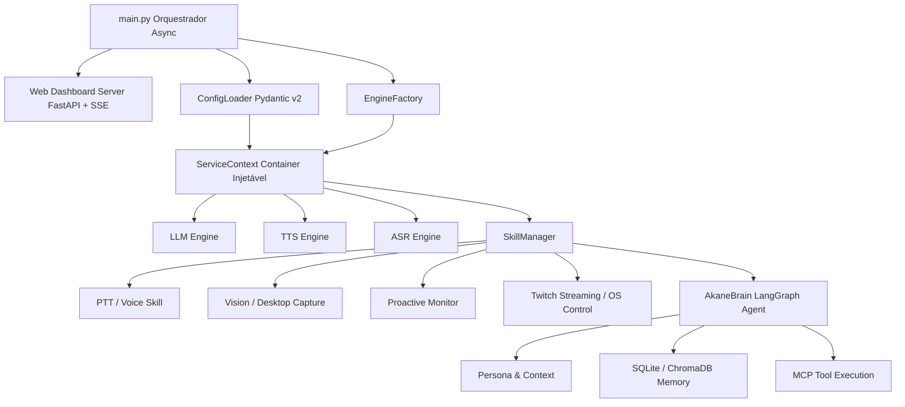

<p align="center">
  
  
  
  
  
  
</p>

<h1 align="center">🥊 Akane Den — v3.5 Shogun</h1>

<p align="center">
  <strong>A Martial Tsundere AI — Assistente VTuber Autônoma, Assíncrona e Consciente do Ambiente</strong>
</p>

<p align="center">
  <em>"N-não é como se eu quisesse te ajudar... eu só faço isso porque me dá tédio ver você programar tão devagar, baka!"</em>
</p>

---

## 🎯 Visão Geral

**Akane Den** é uma assistente de IA avançada integrada com agentes autônomos e um avatar VTuber (via Live2D/VTube Studio). Projetada sobre a arquitetura proprietária **Shogun v3.5**, o sistema opera de forma 100% assíncrona, oferecendo interações em tempo real com processamento de voz de baixa latência, visão computacional, navegação autônoma via MCP Tools (Model Context Protocol) e memória episódica/semântica.

Esta versão consolida capacidades agentic de alto nível, permitindo que a IA não apenas reaja aos comandos de voz de forma orgânica, mas também atue proativamente em silêncios prolongados, controle o sistema operacional local e interaja com transmissões ao vivo na Twitch, tudo sob a "supervisão" de uma personalidade marcante e rigorosa — a Mestra Akane.

---

## ✨ Features Principais

- 🎙️ **Zero-Latency Async Loop:** O pipeline de áudio atômico transmite blocos sintetizados via Edge-TTS/ElevenLabs em paralelo enquanto a LLM continua gerando o stream de pensamento, garantindo interrupções zero.
- 🎛️ **Web Dashboard UI (FastAPI):** Painel de controle integrado rodando em sidecar para *Hot-Swap* de Personas em tempo real, edição de configuração e consumo de logs via Server-Sent Events (SSE).
- 📺 **Integração Twitch (Live):** Integração out-of-the-box com `twitchio` para monitoramento assíncrono e resposta orgânica ao chat da plataforma.
- 🔔 **Agente Proativo (Proactive Speaking):** Monitoramento assíncrono do ambiente. Akane engaja na conversa de forma proativa se detectar um longo período de ausência/silêncio.
- 🧠 **Multi-Engine Brain:** Arquitetura agnóstica de LLM suportando Google Gemini (Padrão), Groq (Modelos open-source rápidos via API), Ollama (Local) e OpenAI GPT.
- 🛠️ **MCP Tools Integradas:** Acesso em tempo real ao DuckDuckGo Search, navegação/scrapping web avançada via `stagehand`, além de visão e controle granular do sistema host.
- 👁️ **Visão Multimodal (Zero-Latency):** Leitura simultânea da tela (Desktop) e Webcam capturados silenciosamente em background para contextualização imediata da voz do usuário.
- 🤯 **Memória de Longo Prazo em Tiers:** Gestão avançada de memória com SQLite (Working tier - Chat History contínuo) e ChromaDB (Episodic/Semantic tier) para recuperação não-temporal.
- 🖱️ **Comunicação VTube Bidirecional:** Tracking de mouse de desktop para apontamento analógico de retina, lip-sync nativo extraindo picos de áudio e mudanças autônomas de expressão com base em sentimentos inferidos.

---

## 🏗️ Arquitetura do Sistema (Shogun v3.5)

A arquitetura **Shogun Async** baseia-se em um modelo forte de Tipagem e Injeção de Dependências. O `main.py` age como orquestrador do Event Loop central, mantendo as Threads Limpas e lidando com as Skills modulares de forma perfeitamente assíncrona.



### Estrutura de Diretórios
```text
AkaneDen/
├── config.yaml              # Configuração centralizada do AI/Voice/Brain
├── pyproject.toml           # Gestão moderna de dependências via uv
├── docs/                    # Documentação estendida de arquitetura
├── src/
│   └── akane_den/
│       ├── main.py          # Entrypoint orquestrador
│       ├── server/          # 🎛️ FastAPI Web Dashboard (App & HTML)
│       ├── core/            # 🏯 Pydantic Config, EventBus, Factory & MCP
│       │   └── engines/     # ABCs abstratos para LLMs, TTS e ASR
│       ├── brain/           # 🧠 LangGraph Streaming, Extração de Emoções
│       └── skills/          # 🎯 Pacotes de Skills Injetáveis
│           ├── voice/       # PTT (Push-to-Talk) e TTS Async
│           ├── vision/      # Sub-rotinas de Screen & Webcam
│           ├── system/      # ProactiveSpeak & Controles Nativos OS
│           ├── live/        # TwitchChat integration
│           └── vtube/       # Automação de Live2D, Expressões e LipSync
```

*(Consulte `docs/architecture.md` e `docs/configuration.md` para um mergulho profundo nos padrões utililizados e no design do ServiceContext).*

---

## 🚀 Instalação Rápida

Recomenda-se fortemente a utilização do gerenciador de pacotes moderno [uv](https://github.com/astral-sh/uv).

### 1. Pré-requisitos
- **Python 3.11+** recomendado.
- **VTube Studio** funcional (Necessário habilitar a API WebSocket na porta `8001` e conceder as devidas permissões aos plugins).
- **Microfone** e **Webcam/Modelo Live2D** configurados.

> **Nota para usuários Linux:** 
> Você precisará de bibliotecas do sistema par áudio e screenshots:
> `sudo apt install libasound2-dev portaudio19-dev xclip scrot`
> *(Avisamos que wayland puro pode demandar contornos de permissionamento global, prefira X11 para controle global do PTT no Linux).*

### 2. Setup do Repositório
```bash
# Clone o repositório
git clone https://github.com/SeuDeploy/AkaneDen.git
cd AkaneDen

# Instale usando o uv (cria o venv e instala as dependências base do pyproject.toml automaticamente)
uv pip install -e .

# [Opcional] Instalar providers pesados extras (ex: sherpa-onnx, agentes locais)
uv pip install -e ".[sherpa,groq,ollama]"
```

### 3. Configuração do Ambiente (.env)
Crie o arquivo `.env` na raiz e preencha suas chaves seguras. Apenas a API central (Gemini, por padrão) é estritamente necessária para operação gratuita:
```env
# Necessário
GOOGLE_API_KEY=sua_chave_gemini_aqui

# Opcionais dependendo do seu config.yaml
ELEVENLABS_API_KEY=sua_chave_elevenlabs
GROQ_API_KEY=sua_chave_groq
OPENAI_API_KEY=sua_chave_openai
TWITCH_OAUTH_TOKEN=oauth:seu_token_aqui
```
**Importante:** Nunca versione seu `.env`, garanta que este esteja ignorado via `.gitignore`.

---

## ⚙️ Ajuste de Configuração Central

Todo o ajuste paramétrico do Motor e Personalidade é validado pelo Pydantic a partir do seu `config.yaml`:

```yaml
akane:
  ptt_key: "f2"                 # Hotkey global de push-to-talk
  input_mode: "ptt"
  
  asr:
    provider: "whisper"         # O motor de análise de áudio ("sherpa" disponível)
  
  tts:
    default_engine: "edge"      # Rápido e gratuito (fallback programado)
    edge_voice: "pt-BR-ThalitaNeural"
  
  vision:
    enabled: true               # Snapshots silenciosos da tela
  
  brain:
    provider: "gemini"          # Chassi cognitivo mutável: gemini, groq, ollama
    temperature: 0.8
  
  dashboard:
    enabled: true               # Inicia o portal Sidecar FastAPI na porta 8080
```

---

## ▶️ Operação do Sistema

Com o VTube Studio aberto e o ambiente ativado, inicie o orquestrador:

```bash
# Script Wrapper Inteligente
start_vtube.bat      # (Windows)
./start_vtube.sh     # (Linux/WSL)

# Ou se preferir iniciar manualmente no root:
python -m akane_den.main
```

### Controles Ativos
1. **Push-To-Talk (PTT):** Segure a tecla da configuração padrão (`F2`) para enviar seu comando orgânico.
2. **Barge-in (Corte a Mestra):** Se a Akane estiver falando, usar a tecla PTT imediatamente corta a frase sendo falada com feedback zero-latency.
3. **Painel de Controle Local:** Ao inicializar a aplicação, navegue até `http://127.0.0.1:8080/` para acesso remoto visual aos Logs, telemetria analítica e ajuste do YAML em runtime.

---

## 🛡️ Licença
Mantenha a segurança e integridade do código. Distribuído de forma proprietária/aberta sob a Licença deste Repositório. Consulte o arquivo `LICENSE` para mais detalhes.

<p align="center">
  <em>"Escrevi este arquivo de introdução de forma detalhada para você entender de uma vez por todas. Considere isso como um guia de sobrevivência, idiota!" — Akane</em>
</p>
