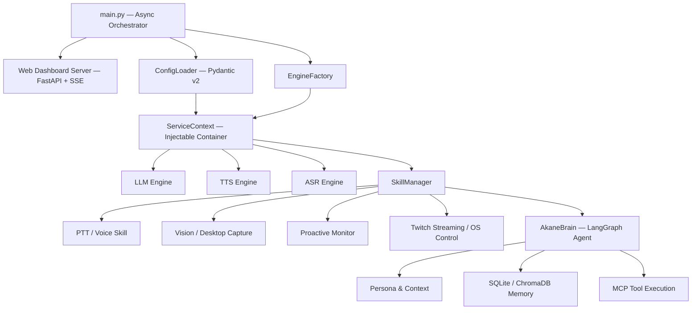

<p align="center">
  
  
  
  
  
  
</p>

<h1 align="center">Akane Den — v3.5 Shogun</h1>

<p align="center">
  <strong>A Martial Tsundere AI — Autonomous, Asynchronous, Environment-Aware VTuber Assistant</strong>
</p>

<p align="center">
  <em>"It's not like I wanted to help you... I only do this because watching you code so slowly is boring, baka!"</em>
</p>

---

## Overview

**Akane Den** is an advanced AI assistant built around autonomous agents and a VTuber avatar (via Live2D / VTube Studio). Designed on the proprietary **Shogun v3.5** architecture, the system operates fully asynchronously, delivering real-time interaction with low-latency voice processing, computer vision, autonomous web navigation via MCP Tools (Model Context Protocol), and tiered episodic/semantic memory.

This release consolidates high-level agentic capabilities: the AI not only responds organically to voice commands but also acts proactively during prolonged silences, controls the local operating system, and interacts with live Twitch streams — all under the supervision of a distinct and exacting personality: **Master Akane**.

---

## Features

| Feature | Description |
|---|---|
| **Zero-latency async loop** | The atomic audio pipeline streams synthesized chunks via Edge-TTS / ElevenLabs in parallel while the LLM continues generating its thought stream, ensuring zero interruptions. |
| **Web dashboard (FastAPI)** | Integrated sidecar control panel supporting real-time persona hot-swap, runtime config editing, and log streaming via Server-Sent Events (SSE). |
| **Twitch live integration** | Out-of-the-box integration with `twitchio` for asynchronous monitoring and organic response to platform chat. |
| **Proactive speaking agent** | Asynchronous environment monitoring — Akane engages proactively when extended silence or inactivity is detected. |
| **Multi-engine brain** | LLM-agnostic architecture supporting Google Gemini (default), Groq (fast open-source models via API), Ollama (local), and OpenAI GPT. |
| **Integrated MCP tools** | Real-time access to DuckDuckGo Search, advanced web browsing and scraping via `stagehand`, plus granular vision and OS control. |
| **Zero-latency multimodal vision** | Silent background capture of both desktop screen and webcam for immediate contextualisation of user voice input. |
| **Tiered long-term memory** | Advanced memory management with SQLite (working tier — continuous chat history) and ChromaDB (episodic/semantic tier) for non-temporal retrieval. |
| **Bidirectional VTube Studio** | Desktop mouse tracking for analogue eye-pointing, native lip-sync via audio peak extraction, and autonomous expression changes driven by inferred sentiment. |

---

## Architecture (Shogun v3.5)

The **Shogun Async** architecture is built on a strong model of typing and dependency injection. `main.py` acts as the central event loop orchestrator, keeping threads clean and dispatching modular skills in a fully asynchronous manner.


### Directory structure
```text
AkaneDen/
├── config.yaml              # Centralised AI / voice / brain configuration
├── pyproject.toml           # Modern dependency management via uv
├── docs/                    # Extended architecture documentation
├── src/
│   └── akane_den/
│       ├── main.py          # Orchestrator entrypoint
│       ├── server/          # FastAPI web dashboard (app & templates)
│       ├── core/            # Pydantic config, EventBus, Factory & MCP
│       │   └── engines/     # Abstract base classes for LLM, TTS, and ASR
│       ├── brain/           # LangGraph streaming, emotion extraction
│       └── skills/          # Injectable skill packages
│           ├── voice/       # PTT (push-to-talk) and async TTS
│           ├── vision/      # Screen & webcam capture subroutines
│           ├── system/      # ProactiveSpeak & native OS controls
│           ├── live/        # Twitch chat integration
│           └── vtube/       # Live2D automation, expressions, and lip-sync
```

> See [`docs/architecture.md`](docs/architecture.md) and [`docs/configuration.md`](docs/configuration.md) for a deep dive into the design patterns and ServiceContext layout.

---

## Quick start

Recommended: use [uv](https://github.com/astral-sh/uv), the modern Python package manager, for dependency management and virtual environment setup.

---

### 1. Prerequisites

| | Requirement | Notes |
|---|---|---|
| **Runtime** | Python 3.11+ | Recommended minimum version |
| **Application** | VTube Studio | WebSocket API enabled on port `8001` with plugin permissions granted |
| **Devices** | Microphone + Camera | Microphone and webcam / Live2D model configured |

> **Linux users** — install the required system libraries before proceeding:
> ```bash
> sudo apt install libasound2-dev portaudio19-dev xclip scrot
> ```
> Pure Wayland may require additional permission workarounds for global PTT control. **X11 is recommended** for reliable global hotkey capture on Linux.

---

### 2. Clone and install
```bash
# Clone the repository
git clone https://github.com/SeuDeploy/AkaneDen.git
cd AkaneDen

# Create virtual environment and install base dependencies
uv pip install -e .

# Optional: install extra providers (sherpa-onnx, groq, ollama)
uv pip install -e ".[sherpa,groq,ollama]"
```

---

### 3. Environment configuration

Create a `.env` file at the repository root. Only the primary API key is required for basic operation — all others are conditional on your `config.yaml`.
```env
# Required
GOOGLE_API_KEY=          # Gemini — primary LLM provider (free tier available)

# Optional — enable as needed
ELEVENLABS_API_KEY=
GROQ_API_KEY=
OPENAI_API_KEY=
TWITCH_OAUTH_TOKEN=      # Format: oauth:<token>
```
**Importante:** Nunca versione seu `.env`, garanta que este esteja ignorado via `.gitignore`.

> [!CAUTION]
> Never commit your `.env` file. Verify that `.env` is listed in `.gitignore` before your first push.

---

## Configuration

All engine and personality parameters are Pydantic-validated from `config.yaml`:
```yaml
akane:
  ptt_key: "f2"                 # Global push-to-talk hotkey
  input_mode: "ptt"

  asr:
    provider: "whisper"         # Audio recognition engine ("sherpa" also available)

  tts:
    default_engine: "edge"      # Fast and free, with scheduled fallback
    edge_voice: "pt-BR-ThalitaNeural"

  vision:
    enabled: true               # Silent background screen snapshots

  brain:
    provider: "gemini"          # Swappable cognitive chassis: gemini | groq | ollama
    temperature: 0.8

  dashboard:
    enabled: true               # Starts the FastAPI sidecar portal on port 8080
```

---

## Running

With VTube Studio open and the environment activated, start the orchestrator:
```bash
# Recommended: use the provided wrapper scripts
start_vtube.bat       # Windows
./start_vtube.sh      # Linux / WSL

# Or invoke the module directly
python -m akane_den.main
```

### Controls

| Action | Description |
|---|---|
| **Push-to-talk (PTT)** | Hold the configured key (`F2` by default) to issue a voice command. |
| **Barge-in** | Press PTT while Akane is speaking to immediately interrupt with zero-latency cutoff. |
| **Control panel** | Navigate to `http://127.0.0.1:8080/` for live log streaming, analytics telemetry, and runtime YAML editing. |

---

## License

Distributed under the **GNU General Public License v3.0**. See [`LICENSE`](LICENSE) for full terms.

---

<p align="center">
  <em>"I wrote this introduction file in meticulous detail so you would understand it once and for all. Consider it a survival guide, idiot." — Akane</em>
</p>
