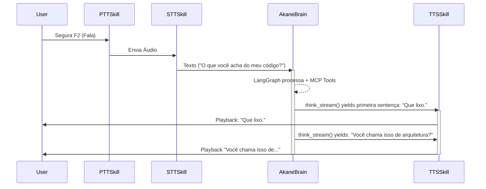

# Arquitetura Shogun Async — AkaneDen v3.5

## Visão Geral

O AkaneDen v3.5 utiliza a **Arquitetura Shogun Async**, um padrão modular fortemente tipado e 100% assíncrono. O `ServiceContext` atua como Container de Injeção de Dependências, gerenciando os provedores (motores) escolhidos no YAML de configuração. A grande adição da v3.5 é o **Dashboard Web (FastAPI)** rodando em paralelo no Event Loop e as Skills de **Proatividade** e **Live Streaming (Twitch)**.

```text
┌───────────────────────────────────────────────────────────────┐
│                   main.py (Orquestrador Async)                 │
│                                                               │
│                   ┌──────────────────────┐                    │
│                   │ Web Dashboard Server │                    │
│                   │ (FastAPI + SSE Logs) │                    │
│                   └──────────┬───────────┘                    │
│                              │ (Hot-Swap Config)              │
│  ┌─────────────────┐   ┌─────▼────────────────────────┐       │
│  │   ConfigLoader  │   │        EngineFactory         │       │
│  │  (Pydantic v2)  │───▶   (Registro Dinâmico)        │       │
│  └─────────────────┘   └──────────────────────────────┘       │
│                                 │                             │
│  ┌──────────────────────────────▼──────────────────────────┐  │
│  │                      ServiceContext                     │  │
│  │     [LLM_Engine]   [TTS_Engine]   [ASR_Engine]          │  │
│  └──────────────────────────────┬──────────────────────────┘  │
│                                 │                             │
│  ┌──────────────────────────────▼──────────────────────────┐  │
│  │                        SkillManager                     │  │
│  │  ┌─────┐ ┌─────┐ ┌──────┐ ┌─────────┐ ┌─────────┐       │  │
│  │  │ PTT │ │ STT │ │Vision│ │Proactive│ │Twitch   │ ...   │  │
│  │  └─────┘ └─────┘ └──────┘ └─────────┘ └─────────┘       │  │
│  └─────────────────────────────────────────────────────────┘  │
│                                                               │
│  ┌─────────────────────────────────────────────────────────┐  │
│  │                LangGraph Brain & Agent                   │  │
│  │  ┌──────────┐ ┌────────┐ ┌─────────┐ ┌─────────────┐    │  │
│  │  │Persona + │ │Emotion │ │ SQLite &│ │ MCP Tools   │    │  │
│  │  │Streaming │ │Analyzer│ │ ChromaDB│ │  (Web/OS)   │    │  │
│  │  └──────────┘ └────────┘ └─────────┘ └─────────────┘    │  │
│  └─────────────────────────────────────────────────────────┘  │
└───────────────────────────────────────────────────────────────┘
```

---

## Componentes Core (v3.5)

### Configuração Estrita (Pydantic)
Em vez de dicionários soltos, configurações são lidas em `AkaneConfig`, dividido em dezenas de submódulos (`DashboardConfig`, `TwitchConfig`, `BrainConfig`, etc...).

### ServiceContext & EngineFactory
A **EngineFactory** registra os Motores base:
- **LLM**: Gemini, Groq, Ollama, OpenAI
- **TTS**: EdgeTTS, ElevenLabs
- **ASR**: Whisper, Sherpa-Onnx

O **ServiceContext** age como o Singleton injetável:
```python
ctx = ServiceContext(config)
await ctx.initialize_engines()
await ctx.get_llm().generate_stream(...)
```

### BaseSkill
As Skills agora recebem o `ServiceContext` diretamente em vez de event_buses ou configs parseados manualmente.
```python
class BaseSkill(ABC):
    def __init__(self, context: SkillContext, service_context: ServiceContext)
    async def setup()
    async def execute(**kwargs)
    async def teardown()
```

---

## Fluxo: Faster First Response

O pipeline de voz agora utiliza streaming avançado para reduzir latência.



*(Enquanto o LLM ainda está gerando a resposta no LangGraph, a primeira sentença já foi cortada por regex no Brain e enviada ao TTS para playback imediato).*

---

## Agentic AI: Proatividade e Memória

- **ProactiveSpeakSkill**: Monitora silenciosamente a ausência de eventos na sessão. Após `timeout` (ex: 5 minutos), injeta um comando oculto no Event Loop engatilhando o Brain para falar sozinho: `"Responda proativamente por causa do silêncio"`.
- **Async Zero-Latency Vision**: A skill de tela captura snapshots silenciosos por trás dos panos, mantendo um cache. Quando o usuário fala, o modelo já tem o frame mais recente em 0 milissegundos, não trancando mais a thread de inferência.
- **FastAPI Dashboard**: Um servidor em thread separada provê UI control, `EventSource` (SSE) para streamar logs nativos do sistema diretamente para o front, e aciona Mutexes que trocam as Personas da memória viva.
- **MCPHandler**: Inicializado no ciclo do ServiceContext, registra ferramentas padrões do Model Context Protocol (DuckDuckGo, Local Browsing).
- **Memória em Tiers**: 
  - **Tier 1 (Working)**: SQLite encapsulando o `ChatHistoryManager` garante que as 50 conversas passadas continuem disponíveis entre reboots, de forma extremamente leve.
  - **Tier 2 (Episodic)**: ChromaDB (se ligado) continua extraindo memórias não temporais.
