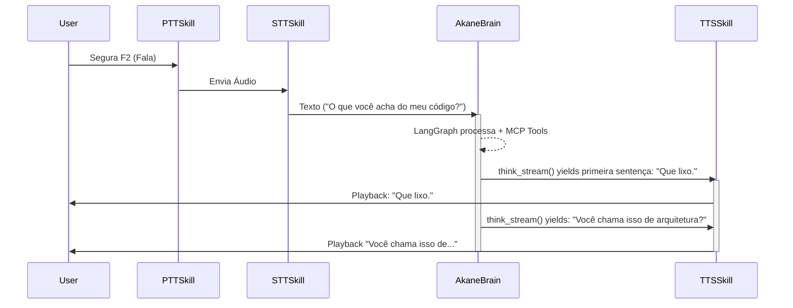

# Arquitetura Shogun Async — AkaneDen v3.0

## Visão Geral

O AkaneDen v3.0 utiliza a **Arquitetura Shogun Async**, um padrão modular fortemente tipado e 100% assíncrono. O `ServiceContext` atua como Container de Injeção de Dependências, gerenciando os provedores (motores) escolhidos no YAML de configuração. Um `SkillManager` central continua gerenciando o ciclo de vida das **Skills** independentes.

```text
┌─────────────────────────────────────────────────────────────┐
│                   main.py (Orquestrador Async)               │
│                                                             │
│  ┌─────────────────┐   ┌──────────────────────────────┐    │
│  │   ConfigLoader  │   │        EngineFactory         │    │
│  │  (Pydantic v2)  │───▶   (Registro Dinâmico)        │    │
│  └─────────────────┘   └──────────────────────────────┘    │
│                                 │                           │
│  ┌──────────────────────────────▼────────────────────────┐ │
│  │                      ServiceContext                     │ │
│  │     [LLM_Engine]   [TTS_Engine]   [ASR_Engine]          │ │
│  └──────────────────────────────┬────────────────────────┘ │
│                                 │                           │
│  ┌──────────────────────────────▼────────────────────────┐ │
│  │                        SkillManager                     │ │
│  │  ┌─────┐ ┌─────┐ ┌─────┐ ┌────────┐ ┌───────┐         │ │
│  │  │ PTT │ │ STT │ │ TTS │ │ Vision │ │ VTube │ ...     │ │
│  │  └─────┘ └─────┘ └─────┘ └────────┘ └───────┘         │ │
│  └───────────────────────────────────────────────────────┘ │
│                                                             │
│  ┌───────────────────────────────────────────────────────┐ │
│  │                LangGraph Brain & Agent                 │ │
│  │  ┌──────────┐ ┌────────┐ ┌─────────┐ ┌─────────────┐  │ │
│  │  │Persona + │ │Emotion │ │ ChromaDB│ │ MCP Tools   │  │ │
│  │  │Streaming │ │Analyzer│ │ Memory  │ │  (Stagehand,│  │ │
│  │  └──────────┘ └────────┘ └─────────┘ │  Web Search)│  │ │
│  │                                      └─────────────┘  │ │
│  └───────────────────────────────────────────────────────┘ │
└─────────────────────────────────────────────────────────────┘
```

---

## Componentes Core (v3.0)

### Configuração Estrita (Pydantic)
Em vez de dicionários soltos, configurações são lidas em `AkaneConfig`, dividido em:
- `BrainConfig`, `VoiceConfig` (tts/asr), `VisionConfig`, `VTubeConfig`, `MCPConfig`, `MemoryConfig`.

### ServiceContext & EngineFactory
A **EngineFactory** registra os Motores base:
- **LLM**: Gemini, Groq, Ollama, OpenAI
- **TTS**: EdgeTTS, ElevenLabs
- **ASR**: Whisper, Sherpa-Onnx

O **ServiceContext** age como o Singleton injetável:
```python
ctx = ServiceContext(config)
await ctx.initialize_engines()
await ctx.get_llm().generate_stream(...)
```

### BaseSkill
As Skills agora recebem o `ServiceContext` diretamente em vez de event_buses ou configs parseados manualmente.
```python
class BaseSkill(ABC):
    def __init__(self, context: SkillContext, service_context: ServiceContext)
    async def setup()
    async def execute(**kwargs)
    async def teardown()
```

---

## Fluxo: Faster First Response

O pipeline de voz agora utiliza streaming avançado para reduzir latência.



*(Enquanto o LLM ainda está gerando a resposta no LangGraph, a primeira sentença já foi cortada por regex no Brain e enviada ao TTS para playback imediato).*

---

## Agentic AI: MCP e Memória

- **MCPHandler**: Inicializado no ciclo do ServiceContext, registra ferramentas padrões do Model Context Protocol. Isso dá ao Brain a capacidade de pesquisar no DuckDuckGo, ler páginas da web (Stagehand) e automatizar o sistema operacional (PyAutoGUI, OS).
- **MemoryHandler**: ChromaDB embutido por padrão que persiste o hitórico do LangGraph na rota `/local_chroma_db`. Quando o boot ocorre, restaura o contexto vitalícia (caso a flag de memória seja ativada). O handler possui interface já designada para compatibilidade futura com Letta/MemGPT.
