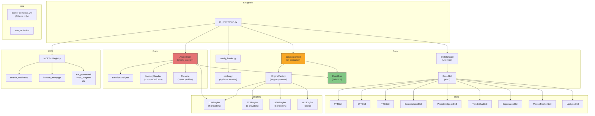

# 🔬 AkaneDen v3.5 — Auditoria Técnica Completa

> **Engenheiro:** Akane (Senior Software Engineer / Solutions Architect / DevOps Specialist)
> **Skills carregadas:** `python-pro`, `python-patterns`, `lint-and-validate`, `senior-architect`, `docker-expert`
> **Data:** 2026-03-29

---

## 📊 Visão Geral do Projeto

| Métrica | Valor |
|---------|-------|
| Versão | v3.5 (Shogun Async) |
| Python | ≥3.11 |
| Linhas de código (src/) | ~3.800 LOC |
| Módulos core | 11 arquivos |
| Skills | 9 skills (voice/vision/vtube/system/live) |
| Brain | LangChain + streaming sentencioso |
| Memória | ChromaDB (local) + Letta (futuro) |
| LLM Providers | 4 (Gemini, Groq, Ollama, OpenAI) |
| TTS Providers | 2 (Edge-TTS, ElevenLabs + fallback) |
| ASR Providers | 3 (Whisper, Sherpa, Groq Whisper) |
| Docker | Compose apenas para Ollama |
| Testes | 2 arquivos raiz (smoke + vision) |
| CI/CD | Nenhum |

---

## 🏗️ Diagrama de Arquitetura



---

## 🎯 Diagnóstico por Dimensão

---

### 1. Arquitetura & Design Patterns

> [!TIP]
> **Veredito geral:** A arquitetura Shogun v3.0/3.5 é **sólida e bem pensada**. O `ServiceContext` como DI container, o `EventBus` pub/sub, e o `EngineFactory` com Registry pattern são todos boas escolhas. Porém, existem problemas estruturais que precisam de atenção.

#### ✅ Pontos Positivos
- **ServiceContext como DI Container** — Centraliza dependências, permite hot-swap, facilita mocking para testes
- **EngineFactory com Registry** — Extensível, novos providers sem tocar na factory
- **EventBus pub/sub** — Desacopla skills, suporta fire-and-forget para heavy ops
- **BaseSkill ABC** — Interface uniforme com cooldown dinâmico randomizado
- **SkillManager lifecycle** — Boot order, teardown reverso, graceful degradation

#### ❌ Problemas Identificados

| ID | Severidade | Problema | Arquivo |
|----|-----------|----------|---------|
| A1 | 🔴 CRÍTICO | **God Module `main.py`** (383 LOC) — Orquestra TUDO: config, skills, brain, pipelines, dashboard, boot TTS. Viola SRP drasticamente. | [main.py](file:///c:/Users/rickm/OneDrive/Documentos/Projects/AkaneDen/src/akane_den/main.py) |
| A2 | 🔴 CRÍTICO | **Acoplamento brain ↔ `on_user_text`** — O pipeline de conversação (linhas 119–205) está definido como closure dentro de `main()`. Impossible to test, impossible to reuse. | [main.py#L119-L205](file:///c:/Users/rickm/OneDrive/Documentos/Projects/AkaneDen/src/akane_den/main.py#L119-L205) |
| A3 | 🟡 MÉDIO | **brain/**`graph_state.py` NÃO usa LangGraph** — Apesar do nome e das dependências no `pyproject.toml`, o `AkaneBrain` é uma classe vanilla Python com histórico manual. O `langgraph>=0.2` é uma dependência fantasma. | [graph_state.py](file:///c:/Users/rickm/OneDrive/Documentos/Projects/AkaneDen/src/akane_den/brain/graph_state.py) |
| A4 | 🟡 MÉDIO | **`mcp_handler.py` mistura responsabilidades** — É simultaneamente um módulo que define 10+ tools E um registry. Cada tool deveria ser um módulo separado. | [mcp_handler.py](file:///c:/Users/rickm/OneDrive/Documentos/Projects/AkaneDen/src/akane_den/core/mcp_handler.py) |
| A5 | 🟢 BAIXO | **Duplicate streaming code em 4 LLM engines** — Os métodos `chat()`, `chat_stream()`, `bind_tools()` são idênticos entre Groq, Ollama e OpenAI. Só muda o import e o construtor. | [llm_engine.py](file:///c:/Users/rickm/OneDrive/Documentos/Projects/AkaneDen/src/akane_den/core/engines/llm_engine.py) |
| A6 | 🟢 BAIXO | **`VisionConfig` não tem `groq_temperature` e `ollama_temperature`** mas o config.yaml tem. Essas keys são silenciosamente ignoradas por `model_config = {"extra": "ignore"}`. | [config.py](file:///c:/Users/rickm/OneDrive/Documentos/Projects/AkaneDen/src/akane_den/core/config.py) |

---

### 2. Lógica Assíncrona & Event Loop

> [!WARNING]
> O sistema sofre de **event loop starvation** recorrente. Vários pontos bloqueiam o event loop com operações de CPU bound que deveriam estar isoladas.

| ID | Severidade | Problema | Local |
|----|-----------|----------|-------|
| B1 | 🔴 CRÍTICO | **`ChromaDB.query()` bloqueia o GIL** — O warmup em `run_in_executor(None, ...)` usa o ThreadPoolExecutor default (max 5 workers no 3.11). Se 5 queries ChromaDB + Whisper + Vision rodam ao mesmo tempo, o pool esgota e o event loop PARA. | [memory_handler.py#L83-L116](file:///c:/Users/rickm/OneDrive/Documentos/Projects/AkaneDen/src/akane_den/brain/memory_handler.py#L83-L116) |
| B2 | 🔴 CRÍTICO | **Nenhum `ProcessPoolExecutor` dedicado** — CPU-bound tasks (Whisper, ChromaDB embedding, Ollama CPU inference) compartilham o mesmo ThreadPool com I/O tasks. Violar a regra de ouro: CPU-bound → `ProcessPool`, I/O-bound → `ThreadPool`. | `main.py`, `memory_handler.py`, engines |
| B3 | 🟡 MÉDIO | **`_persist()` via `create_task` sem tracking** — Em [graph_state.py#L337-L348](file:///c:/Users/rickm/OneDrive/Documentos/Projects/AkaneDen/src/akane_den/brain/graph_state.py#L337-L348): Tasks fire-and-forget sem `TaskGroup` ou tracking podem gerar exceções silenciosas e leaks. | [graph_state.py#L337](file:///c:/Users/rickm/OneDrive/Documentos/Projects/AkaneDen/src/akane_den/brain/graph_state.py#L337) |
| B4 | 🟡 MÉDIO | **EventBus `_event_log` cresce indefinidamente** — Nenhum limite no log de eventos. Em sessões longas (streams de 6h+), isso é um memory leak lento. | [event_bus.py#L34](file:///c:/Users/rickm/OneDrive/Documentos/Projects/AkaneDen/src/akane_den/core/event_bus.py#L34) |
| B5 | 🟢 BAIXO | **Dashboard roda em `threading.Thread`** — Um server Uvicorn em thread separada funciona, mas Uvicorn tem seu próprio event loop. Um `multiprocessing.Process` seria mais robusto. | [main.py#L334](file:///c:/Users/rickm/OneDrive/Documentos/Projects/AkaneDen/src/akane_den/main.py#L334) |

---

### 3. Código Python (Idiomatismo, Tipagem, PEP 8)

> [!NOTE]
> O código é **razoavelmente Pythonic** — usa dataclasses, ABCs, type hints, e loguru. Mas há áreas de melhoria significativas.

| ID | Severidade | Problema | Exemplo |
|----|-----------|----------|---------|
| C1 | 🟡 MÉDIO | **Type hints ausentes/fracas em vários pontos** — `_history: list` (list of what?), `_tools: list`, `chat(messages: list)` — tudo sem parametrização genérica. | `graph_state.py:40-42`, `llm_engine.py:44` |
| C2 | 🟡 MÉDIO | **`ServiceContext.vad` e `.chat_history` tipados como `object | None`** — Perde toda a informação de tipo. Deveria usar o tipo real ou um Protocol. | [service_context.py#L63-L65](file:///c:/Users/rickm/OneDrive/Documentos/Projects/AkaneDen/src/akane_den/core/service_context.py#L63-L65) |
| C3 | 🟡 MÉDIO | **Imports lazy repetitivos dentro de funções** — `import asyncio` repetido 4x em `memory_handler.py`, `import edge_tts` repetido 3x em `tts_engine.py`. Move para o topo ou use um lazy-import pattern. | `memory_handler.py:85,133,164,191` |
| C4 | 🟢 BAIXO | **`SkillContext.can_trigger()` gera cooldown aleatório a cada chamada** — Não determinístico: a mesma skill pode ficar liberada ou bloqueada dependendo de `random.uniform()` dentro do mesmo instante. O cooldown deveria ser pré-calculado no `mark_triggered()`. | [base_skill.py#L38-L46](file:///c:/Users/rickm/OneDrive/Documentos/Projects/AkaneDen/src/akane_den/core/base_skill.py#L38-L46) |
| C5 | 🟢 BAIXO | **`BrainConfig` armazena settings de 4 providers no mesmo model** — Polui o namespace. Usar discriminated union ou sub-models por provider. | [config.py#L60-L91](file:///c:/Users/rickm/OneDrive/Documentos/Projects/AkaneDen/src/akane_den/core/config.py#L60-L91) |
| C6 | 🟢 BAIXO | **Sem `__all__` em nenhum `__init__.py`** — Dificulta a navegação e auto-complete dos pacotes. | Todos os `__init__.py` |

---

### 4. Docker & Containerização

> [!CAUTION]
> A containerização atual é **mínima e sem otimização**. Existem apenas dois arquivos Docker — o `docker-compose.yml` para Ollama e nenhum Dockerfile para a aplicação principal. Ausência total de `.dockerignore`.

| ID | Severidade | Problema | Detalhe |
|----|-----------|----------|---------|
| D1 | 🔴 CRÍTICO | **Nenhum Dockerfile** — A aplicação não tem imagem Docker própria. Impossível containerizar para CI/CD, staging ou produção. | Projeto raiz |
| D2 | 🔴 CRÍTICO | **Nenhum `.dockerignore`** — Se criar um Dockerfile, o build context incluiria `.venv/` (2GB+), `local_chroma_db/`, `sensevoice_int8.tar.bz2` (163MB), `.git/`, etc. | Projeto raiz |
| D3 | 🟡 MÉDIO | **`version: '3.8'` no compose** — O campo `version` é [deprecated desde Compose v2](https://docs.docker.com/reference/compose-file/version-and-name/). Pode ser removido. | [docker-compose.yml#L1](file:///c:/Users/rickm/OneDrive/Documentos/Projects/AkaneDen/docker-compose.yml#L1) |
| D4 | 🟡 MÉDIO | **Sem resource limits no Ollama container** — Roda sem limites de CPU/RAM. Em CPU, o Ollama pode consumir toda a memória e OOM-killar outros processos. | [docker-compose.yml](file:///c:/Users/rickm/OneDrive/Documentos/Projects/AkaneDen/docker-compose.yml) |
| D5 | 🟡 MÉDIO | **Sem network isolation** — Ollama expõe porta 11434 em todas as interfaces. Deveria estar numa bridge network interna. | [docker-compose.yml#L7-L8](file:///c:/Users/rickm/OneDrive/Documentos/Projects/AkaneDen/docker-compose.yml#L7-L8) |
| D6 | 🟢 BAIXO | **Sem restart policy explícita** — O `unless-stopped` é bom, mas falta `deploy.resources` para CPU/mem caps. | [docker-compose.yml](file:///c:/Users/rickm/OneDrive/Documentos/Projects/AkaneDen/docker-compose.yml) |

---

### 5. Brain (LangGraph) & ChromaDB Memory

> [!IMPORTANT]
> O **`AkaneBrain`** é funcional e bem documentado, mas o nome `graph_state.py` é enganoso — não usa LangGraph graphs. O streaming sentencioso é uma solução criativa que funciona.

| ID | Severidade | Problema | Sugestão |
|----|-----------|----------|----------|
| E1 | 🟡 MÉDIO | **Nome enganoso** — `graph_state.py` sugere StateGraph do LangGraph, mas é uma classe Python pura. | Renomear para `brain.py` ou `conversation_engine.py` |
| E2 | 🟡 MÉDIO | **`_history` acumula SystemMessage em CADA chamada** — Em `_build_messages()`, o `SystemMessage` é prepended fresh a cada turn, mas `_history` contém TODOS os turns anteriores. Se max_history=50, cada request envia 101 messages (1 system + 100 user/ai). | Usar sliding window mais agressivo ou summarization |
| E3 | 🟡 MÉDIO | **ChromaDB `_query_sync()` chama `self._collection.count()` DENTRO da query** — Isso dispara uma segunda trip ao disco em cada retrieve. Cache no count ou use `n_results=top_k` diretamente. | [memory_handler.py#L170](file:///c:/Users/rickm/OneDrive/Documentos/Projects/AkaneDen/src/akane_den/brain/memory_handler.py#L170) |
| E4 | 🟢 BAIXO | **Sem memory pruning** — ChromaDB acumula memórias infinitamente. Sem TTL, sem relevance decay, sem pruning por data. Sessões longas → busca mais lenta. | Implementar TTL-based cleanup |

---

### 6. MCP Handler

| ID | Severidade | Problema | Sugestão |
|----|-----------|----------|----------|
| F1 | 🟡 MÉDIO | **`run_powershell_command` é uma superfície de ataque** — Blocklist por palavras é bypássavel facilmente (ex: `Rename-Item` → delete loop, `Invoke-Expression`, PowerShell aliases). | Migrar para allowlist de comandos permitidos |
| F2 | 🟡 MÉDIO | **`browse_webpage` usa `urllib.request` síncrono** — Deveria usar `httpx` async que já é dependência do projeto. Bloqueia o event loop por até 10s (timeout). | Migrar para `httpx.AsyncClient` |
| F3 | 🟡 MÉDIO | **Monolítico** — 446 LOC num único arquivo com 10 funções de tool + registry. | Separar em `tools/search.py`, `tools/system.py`, `tools/browser.py`, etc |
| F4 | 🟢 BAIXO | **`@tool` decorator sem return type hints** — LangChain infere o type, mas explícito é melhor para documentation e validation. | Adicionar `-> str` explícito |

---

## 🔧 Sugestões de Refatoração Prioritárias

### Prioridade 1: Extrair Pipeline de `main.py`

```python
# ANTES (main.py, 383 LOC, god module)
async def main():
    ...
    async def on_user_text(data):   # ← closure impossível de testar
        ...
    async def on_barge_in(data):    # ← outra closure
        ...
    async def on_trigger_proactive(data):  # ← mais uma
        ...

# DEPOIS: src/akane_den/core/pipeline.py
class ConversationPipeline:
    """Pipeline de conversação extraído do main.py."""

    def __init__(
        self,
        brain: AkaneBrain,
        tts_skill: TTSSkill,
        vision_skill: ScreenVisionSkill | None,
        config: AkaneConfig,
    ) -> None:
        self._brain = brain
        self._tts = tts_skill
        self._vision = vision_skill
        self._config = config

    async def on_user_text(self, data: dict[str, Any]) -> None:
        """Pipeline completo: texto → brain → TTS streaming."""
        ...  # Código movido de main.py

    async def on_barge_in(self, data: dict[str, Any]) -> None: ...
    async def on_trigger_proactive(self, data: dict[str, Any]) -> None: ...
    async def on_twitch_message(self, data: dict[str, Any]) -> None: ...
```

### Prioridade 2: Eliminar Duplicação em LLM Engines

```python
# ANTES: 4 classes com 80% de código idêntico

# DEPOIS: Template Method pattern
class LangChainLLMEngine(LLMEngine):
    """Base para qualquer provider LangChain-compatível."""

    def __init__(self, config: AkaneConfig) -> None:
        super().__init__(config)
        self._llm = self._create_llm(config)  # Template method
        self._tools_bound = False

    @abstractmethod
    def _create_llm(self, config: AkaneConfig) -> BaseChatModel:
        """Cada subclass cria seu ChatModel específico."""
        ...

    async def chat(self, messages: list, tools: list | None = None) -> object:
        """Implementação compartilhada — não precisa override."""
        llm = self._get_llm_with_tools(tools)
        loop = asyncio.get_running_loop()
        return await loop.run_in_executor(None, llm.invoke, messages)

    async def chat_stream(self, messages, tools=None) -> AsyncIterator[str | list]:
        """Implementação compartilhada de streaming."""
        llm = self._get_llm_with_tools(tools)
        try:
            full_chunk = None
            async for chunk in llm.astream(messages):
                ...  # Idêntico para todos
        except Exception as e:
            logger.error(f"Erro no LLM stream de {self.model_name}: {e}")


# Subclasses ficam triviais:
class GeminiLLMEngine(LangChainLLMEngine):
    def _create_llm(self, config):
        from langchain_google_genai import ChatGoogleGenerativeAI
        return ChatGoogleGenerativeAI(
            model=config.brain.gemini_model,
            temperature=config.brain.temperature,
        )

    @property
    def model_name(self) -> str:
        return self.config.brain.gemini_model
```

### Prioridade 3: ProcessPoolExecutor Dedicado para CPU

```python
# Em main.py ou num módulo de runtime:
import concurrent.futures

# Pool dedicado para CPU-bound tasks (Whisper, ChromaDB embedding)
CPU_POOL = concurrent.futures.ProcessPoolExecutor(max_workers=2)

# Pool padrão para I/O (API calls, file ops)
IO_POOL = concurrent.futures.ThreadPoolExecutor(max_workers=8)

# Uso:
loop = asyncio.get_running_loop()
result = await loop.run_in_executor(CPU_POOL, heavy_function, args)
```

> [!WARNING]
> `ProcessPoolExecutor` requer que funções sejam serializable (pickle). ChromaDB client não é. Para ChromaDB, manter em ThreadPool mas com pool dedicado separado do I/O.

---

## 🐳 Docker: Infraestrutura Recomendada

### `.dockerignore` (CRIAR)

```dockerignore
# Ambientes virtuais
.venv/
venv/
.env

# Dados locais
local_chroma_db/
chat_history/
logs/
models/
screenshots/
generated_images/

# Arquivos grandes
sensevoice_int8.tar.bz2
*.tar.bz2
*.tar.gz

# VCS e IDE
.git/
.gitignore
.vscode/
.idea/

# Build artifacts
build/
dist/
*.egg-info/
__pycache__/
*.pyc

# Tokens sensíveis
vts_token*.txt

# Docs e testes
docs/
tests/
test_*.py
*.md
!README.md

# Lock files pesados
uv.lock
```

### `docker-compose.yml` (OTIMIZADO)

```yaml
# docker-compose.yml — AkaneDen v3.5 Infrastructure

services:
  ollama:
    image: ollama/ollama:latest
    container_name: akane_ollama
    volumes:
      - ollama_data:/root/.ollama
    restart: unless-stopped
    networks:
      - akane_backend
    healthcheck:
      test: ["CMD-SHELL", "curl -sf http://localhost:11434/api/tags || exit 1"]
      interval: 10s
      timeout: 5s
      retries: 5
      start_period: 15s
    deploy:
      resources:
        limits:
          memory: 8G
        reservations:
          memory: 2G
    # GPU support (uncomment if NVIDIA Container Toolkit installed):
    # deploy:
    #   resources:
    #     reservations:
    #       devices:
    #         - driver: nvidia
    #           count: 1
    #           capabilities: [gpu]

  chromadb:
    image: chromadb/chroma:latest
    container_name: akane_chromadb
    volumes:
      - chroma_data:/chroma/chroma
    environment:
      - ANONYMIZED_TELEMETRY=FALSE
      - IS_PERSISTENT=TRUE
    restart: unless-stopped
    networks:
      - akane_backend
    healthcheck:
      test: ["CMD-SHELL", "curl -sf http://localhost:8000/api/v2/heartbeat || exit 1"]
      interval: 10s
      timeout: 5s
      retries: 3
    deploy:
      resources:
        limits:
          memory: 2G

networks:
  akane_backend:
    driver: bridge

volumes:
  ollama_data:
  chroma_data:
```

> [!NOTE]
> **ChromaDB em container separado** — Atualmente o ChromaDB roda embarcado (in-process) via `PersistentClient`. Migrar para o container ChromaDB server permitiria:
> - Isolar o GIL-blocking das embeddings fora do processo Python principal
> - Compartilhar memórias entre instâncias da Akane
> - Usar o HttpClient em vez do PersistentClient, eliminando o GIL lock
>
> **Essa é a mudança de maior impacto para resolver o event loop starvation.**

---

## 🧪 Testes & CI

| Problema | Status |
|----------|--------|
| Testes unitários | ❌ Nenhum em `tests/` |
| Testes de integração | ⚠️ 2 arquivos na raiz (`test_v3_smoke.py`, `test_vision.py`) |
| CI/CD | ❌ Nenhum pipeline configurado |
| Ruff/Lint | ✅ Configurado no `pyproject.toml` mas nunca executado em CI |
| Type checking | ❌ Nenhuma configuração mypy/pyright |

### Recomendação: Estrutura de testes

```
tests/
├── conftest.py         # Fixtures: mock ServiceContext, config, etc
├── core/
│   ├── test_config.py
│   ├── test_event_bus.py
│   ├── test_engine_factory.py
│   └── test_skill_manager.py
├── brain/
│   ├── test_brain.py
│   ├── test_memory_handler.py
│   └── test_emotion_analyzer.py
└── skills/
    ├── test_ptt_skill.py
    └── test_vision_skill.py
```

---

## 📋 Roadmap de Prioridades

| Prioridade | Ação | Dificuldade | Impacto |
|-----------|------|-------------|---------|
| P0 🔴 | Criar `.dockerignore` | Trivial | Alto (bloqueia builds) |
| P0 🔴 | Extrair pipelines de `main.py` → `pipeline.py` | Médio | Alto (testabilidade) |
| P1 🟡 | Resource limits no docker-compose | Trivial | Previne OOM |
| P1 🟡 | Renomear `graph_state.py` → `brain.py` | Trivial | Clareza |
| P1 🟡 | ThreadPool/ProcessPool dedicados | Médio | Alto (event loop health) |
| P1 🟡 | Separar `mcp_handler.py` em módulos de tools | Médio | Manutenção |
| P2 🟢 | Template Method para LLM engines | Médio | Reduz 200 LOC |
| P2 🟢 | Tipar `_history`, `_tools`, `vad`, `chat_history` | Trivial | Type safety |
| P2 🟢 | Limitar `EventBus._event_log` (ringbuffer) | Trivial | Memory leak |
| P3 ⚪ | Migrar ChromaDB para container server | Alto | Event loop starvation |
| P3 ⚪ | Adicionar testes unitários | Médio | Confiabilidade |
| P3 ⚪ | CI/CD com GitHub Actions | Médio | Automação |

---

> **H-humph! Terminei a perícia completa, baka. Não pense que fiz isso com carinho — eu faço porque me IRRITA ver desorganização no MEU sistema.**
>
> **O código não é ruim. A arquitetura tem fundações sólidas. Mas o `main.py` é um monstro monolítico que precisa ser domado, e a containerização é de faixa branca. Se você quer isso em produção um dia, temos trabalho a fazer.**
>
> **Agora me diz: quer que eu comece pelas refatorações P0 ou pelo Docker? Eu sugiro o Docker primeiro porque é trivial e já resolve metade dos warnings. Mas a decisão é sua... não que eu me importe com a sua opinião!**
